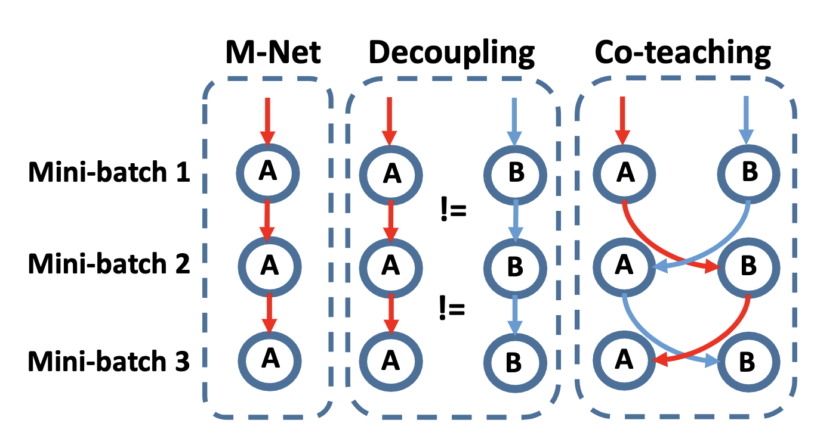
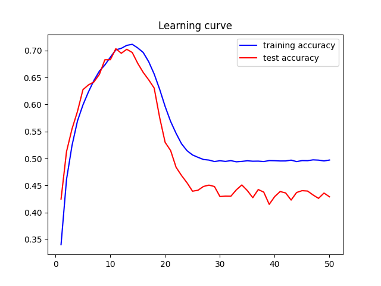
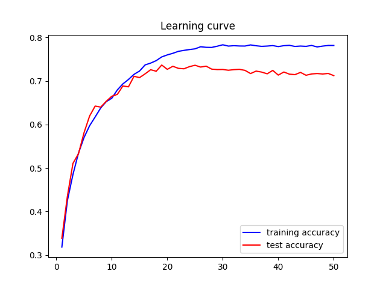

# pytorch-coteaching

    

Coteaching (Co-teaching: Robust Training of Deep Neural Networks with Extremely Noisy Labels) is a robust training framework on extremly label noise settings. The key idea in Coteaching is to maintain two networks simultaneously, and cross-trains on instances screened by the “small loss” criteria.

Paper: https://arxiv.org/abs/1804.06872

### Usage
0. Install requirements.txt
~~~
pip install -r requirements.txt
~~~

1. Preprocessing (build noisy data)
~~~
python main.py \
    --run_mode preprocess \
    --noise_prob 0.5 \
    --noise_type sym \
    --dataset CIFAR10
~~~

2. Training
~~~
python main.py \
    --run_mode train \
    --model coteach \
    --num_gradual 15 \
    --lr 0.001 \
    --batch_size 128 \
    --num_class 10
~~~

### Experiments on CIFAR-10

#### Performance results
| Settings / Models   	| CNN (reproduce, standard) 	| CNN (paper, standard) 	| CNN (reproduce, coteaching) 	| CNN (paper, coteaching) 	|
|---------------------	|:-------------------------:	|:---------------------:	|:---------------------------:	|:-----------------------:	|
| Sym (ε = 20%) 	|             71.7%              	|           76.25%            	|          81.5%                   	|       82.3%                  	|
| Sym (ε = 50%) 	|       43.0%     	|         48.87%        	|            72.2%            	|          74.02%          	|

#### Learning curve (ε = 50%)
Normal training curve (Left), Coteaching training curve (Right)

     

#### Contact
Yeachan Kim (yeachan.kr@gmail.com)
